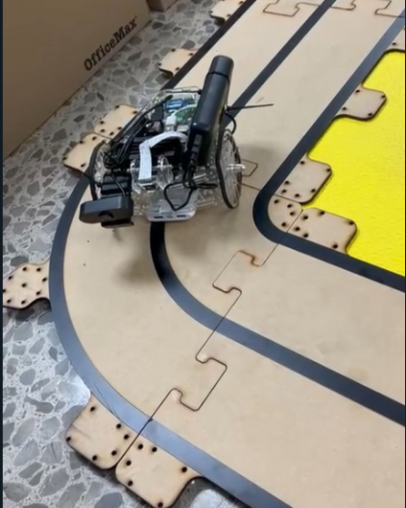
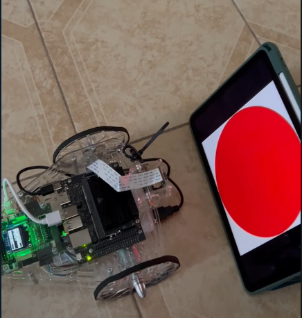
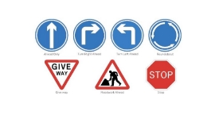
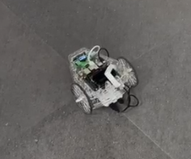

<div align="center">

# 🤖 PuzzleBot ROS 2 Framework

[](https://docs.ros.org/en/humble/)
[](LICENSE)
[](https://www.python.org/)
[](https://ubuntu.com/)
[]()
[]()

**Control avanzado para robots móviles PuzzleBot usando ROS 2**  
*Seguimiento de líneas, detección de señales/semáforos y navegación autónoma*

[🚀 Inicio rápido](#-inicio-rápido) •
[📦 Instalación](#-instalación) •
[📋 Características](#-características) •
[🔄 Arquitectura](#-arquitectura-del-sistema) •
[📝 Documentación](#-documentación) •
[⚙️ Configuración](#-configuración-avanzada)


</div>

---

## 🌟 Características principales

<table>
  <tr>
    <td width="25%" align="center">
      <br>
      <b>Seguimiento de líneas</b><br>
      <span style="color:#00796b">Algoritmos avanzados de visión con filtrado HSV adaptativo</span>
    </td>
    <td width="25%" align="center">
      <br>
      <b>Detección de semáforos</b><br>
      <span style="color:#c62828">Reconocimiento en tiempo real con clasificación por color</span>
    </td>
    <td width="25%" align="center">
      <br>
      <b>Detección de señales</b><br>
      <span style="color:#1565c0">Identificación y respuesta a señales de tráfico</span>
    </td>
    <td width="25%" align="center">
      <br>
      <b>Navegación autónoma</b><br>
      <span style="color:#6a1b9a">Control PID optimizado para trayectorias precisas</span>
    </td>
  </tr>
</table>

## 🚀 Inicio rápido

<div style="background-color: #f6f8fa; padding: 15px; border-radius: 6px; margin: 20px 0;">
<p><strong>⏱️ En menos de 5 minutos podrás estar desarrollando con PuzzleBot:</strong></p>

```bash
# Clonar el repositorio
git clone https://github.com/AldonDC/puzzlebot-ros2-control.git
cd puzzlebot-ros2-control

# Configuración automática (una sola vez)
chmod +x scripts/puzzlebot_pro.sh
./scripts/puzzlebot_pro.sh

# ¡Comienza a trabajar con el PuzzleBot!
puzzlebot
```
</div>

## 📦 Instalación

### Requisitos previos

<table>
  <tr>
    <td></td>
    <td>Ubuntu 20.04/22.04</td>
  </tr>
  <tr>
    <td></td>
    <td>ROS 2 Humble/Foxy</td>
  </tr>
  <tr>
    <td></td>
    <td>Python 3.8+</td>
  </tr>
  <tr>
    <td></td>
    <td>OpenCV 4.2+</td>
  </tr>
</table>

### Instalación automática

Nuestro framework incluye scripts de configuración automática que detectan tu entorno y configuran todo lo necesario:

```bash
# Dar permisos de ejecución
chmod +x scripts/puzzlebot_pro.sh

# Ejecutar configuración
./scripts/puzzlebot_pro.sh
```

<div style="background-color: #e8f5e9; padding: 15px; border-radius: 6px; border-left: 4px solid #4caf50; margin: 20px 0;">
<p><strong>✅ El script realiza automáticamente:</strong></p>
<ul>
  <li>Detección automática de la IP de tu laptop en la red 10.42.0.x</li>
  <li>Configuración de las variables de entorno ROS_DOMAIN_ID y ROS_IP</li>
  <li>Creación de alias útiles para uso diario</li>
  <li>Verificación de la conexión con el PuzzleBot</li>
</ul>
</div>

## 📋 Características

### Sistema modular de control

<div align="center">
  
</div>

### Nodos principales

#### Control

| Nodo | Descripción | Tópicos publicados | Tópicos suscritos |
|------|-------------|-------------------|-------------------|
| <code style="color:#2e7d32">line_follower_controller</code> | Sigue líneas mediante visión con filtrado HSV adaptativo | `/cmd_vel` | `/line_position` |
| <code style="color:#c62828">traffic_light_controller</code> | Detecta y responde a semáforos con transiciones suaves | `/cmd_vel` | `/traffic_light` |
| <code style="color:#0d47a1">sign_response_controller</code> | **NUEVO**: Responde a señales de tráfico detectadas | `/cmd_vel` | `/traffic_sign`, `/odom` |
| <code style="color:#e65100">pid_controller_node</code> | Control PID optimizado para movimiento preciso | `/cmd_vel` | `/target`, `/odom` |
| <code style="color:#4527a0">path_generator_node</code> | Genera trayectorias para navegación autónoma | `/target` | `/odom` |
| <code style="color:#00695c">odometry_node</code> | Cálculo mejorado de posición con fusión de datos | `/odom` | `/encoders` |

#### Detección

| Nodo | Descripción | Tópicos publicados | Tópicos suscritos |
|------|-------------|-------------------|-------------------|
| <code style="color:#c62828">traffic_detector</code> | Detecta semáforos con algoritmos robustos | `/traffic_light` | `/image_raw` |
| <code style="color:#0d47a1">sign_detector</code> | **NUEVO**: Identifica señales de tráfico (STOP, GIVE WAY, etc.) | `/traffic_sign` | `/image_raw` |
| <code style="color:#2e7d32">angular_error_node</code> | Cálculo optimizado de error angular para navegación precisa | `/angular_error` | `/image_raw` |
| <code style="color:#6a1b9a">debug_visualizer</code> | Visualización en tiempo real del procesamiento de imágenes | `/debug_image` | `/image_raw` |

### Comandos útiles

<div style="background-color: #fffde7; padding: 15px; border-radius: 6px; border-left: 4px solid #fbc02d; margin: 20px 0;">
<p><strong>💡 Comandos de uso frecuente:</strong></p>

```bash
# Activar entorno PuzzleBot
puzzlebot

# Monitorear tópicos
puzzlemon

# Lanzar nodos específicos
./scripts/launch_puzzlebot.sh
```
</div>

## 🔄 Arquitectura del Sistema

### Diagrama de Comunicación entre Nodos

<div align="center">
  
</div>

<div style="background-color: #e3f2fd; padding: 15px; border-radius: 6px; border-left: 4px solid #2196f3; margin: 20px 0;">
<p><strong>🔍 Detalles de la arquitectura:</strong></p>
<ul>
  <li>Comunicación basada en el modelo publicador-suscriptor de ROS 2</li>
  <li>Separación clara entre módulos de percepción, control y planificación</li>
  <li>Flujo de datos optimizado para minimizar latencia en operaciones críticas</li>
  <li>Diseño modular que permite añadir o modificar componentes fácilmente</li>
</ul>
</div>

## 🔧 Conexión con el PuzzleBot

El framework está optimizado para la red PuzzleBot donde:
- **Jetson**: IP fija en 10.42.0.2
- **Tu laptop**: IP automáticamente detectada en la red 10.42.0.x

### Explicación detallada de la configuración ROS 2

Para garantizar la comunicación correcta entre todos los miembros del equipo y el PuzzleBot, es importante entender cómo funciona:

<div style="display: flex; gap: 20px; margin: 20px 0;">
  <div style="flex: 1; background-color: #f3e5f5; padding: 15px; border-radius: 6px; border-left: 4px solid #9c27b0;">
    <p><strong>En la laptop de cada miembro del equipo:</strong></p>
    <pre><code>export ROS_DOMAIN_ID=0        # Mismo valor para todos
export ROS_IP=10.42.0.X       # La IP de cada laptop (diferente para cada uno)
                             # Por ejemplo: 10.42.0.91 para un miembro, 10.42.0.92 para otro</code></pre>
  </div>
  <div style="flex: 1; background-color: #e8f5e9; padding: 15px; border-radius: 6px; border-left: 4px solid #4caf50;">
    <p><strong>En la Jetson (PuzzleBot):</strong></p>
    <pre><code>export ROS_DOMAIN_ID=0        # Mismo valor que en las laptops
export ROS_IP=10.42.0.2       # IP fija de la Jetson</code></pre>
  </div>
</div>

**Puntos clave:**

1. **ROS_DOMAIN_ID** determina qué nodos ROS 2 pueden "verse" entre sí. Todos los dispositivos con el mismo DOMAIN_ID pueden comunicarse.

2. **ROS_IP** le dice a ROS 2 qué dirección IP usar para la comunicación. Cada dispositivo usa su propia IP.

3. **No es necesario** configurar la IP de los otros dispositivos. ROS 2 descubre automáticamente a todos los nodos en el mismo DOMAIN_ID.

El script `puzzlebot_pro.sh` configura automáticamente estas variables para ti, detectando tu IP en la red 10.42.0.x y configurando el DOMAIN_ID adecuado.

### Nota importante para el equipo

<div style="background-color: #ffebee; padding: 15px; border-radius: 6px; border-left: 4px solid #f44336; margin: 20px 0;">
<p><strong>⚠️ Para garantizar la comunicación entre todos los miembros del equipo y el PuzzleBot:</strong></p>
<ol>
  <li>Todos deben usar <strong>ROS_DOMAIN_ID=0</strong> al configurar con el script puzzlebot_pro.sh</li>
  <li>Todos deben estar conectados a la misma red WiFi del PuzzleBot</li>
  <li>La Jetson del PuzzleBot tiene la IP fija 10.42.0.2</li>
</ol>
</div>

## 📝 Documentación

### Estructura del repositorio

```
puzzlebot_ws/
├── assets/                         # Imágenes y recursos para documentación
├── build/                          # Archivos de compilación (generados)
├── control_pkg/                    # Paquete de controladores
│   ├── control_pkg/
│   │   ├── __init__.py
│   │   ├── line_follower_controller.py    # Mejorado con filtrado HSV adaptativo
│   │   ├── traffic_light_controller.py    # Actualizado con transiciones suaves
│   │   ├── sign_response_controller.py    # NUEVO: Respuesta a señales de tráfico
│   │   ├── pid_controller_node.py         # Control PID optimizado (COMPONENTE CRÍTICO)
│   │   ├── path_generator_node.py         # Generación de trayectorias básicas
│   │   └── odometry_node.py               # Mejorado con fusión de datos
│   ├── resource/                   # Recursos del paquete
│   ├── test/                       # Pruebas unitarias
│   ├── package.xml
│   └── setup.*
│
├── detector_pkg/                   # Paquete de algoritmos de detección
│   ├── detector_pkg/
│   │   ├── __init__.py
│   │   ├── traffic_detector.py           # Algoritmo robusto de detección
│   │   ├── sign_detector.py              # NUEVO: Detector de señales de tráfico
│   │   ├── angular_error_node.py         # Cálculo optimizado de error angular para corrección en eje Z
│   │   └── debug_visualizer.py           # Visualización para debug
│   ├── resource/                   # Recursos del paquete
│   ├── test/                       # Pruebas unitarias
│   ├── package.xml
│   └── setup.*
│
├── install/                        # Archivos de instalación (generados)
├── log/                            # Registros de ejecución
├── scripts/                        # Scripts de configuración y utilidades
│   └── puzzlebot_pro.sh            # Configuración automática
│
├── .gitignore                      # Archivos ignorados por Git
├── LICENSE                         # Licencia MIT
└── README.md                       # Esta documentación
```

### Uso de colores en terminal

El código utiliza una clase `TerminalColors` para mejorar la visualización en terminal:

```python
class TerminalColors:
    HEADER = '\033[95m'
    BLUE = '\033[94m'
    CYAN = '\033[96m'
    GREEN = '\033[92m'
    YELLOW = '\033[93m'
    RED = '\033[91m'
    ENDC = '\033[0m'
    BOLD = '\033[1m'
    UNDERLINE = '\033[4m'
```

## ⚙️ Configuración Avanzada

### Personalización del entorno

Para configuraciones personalizadas, edita:
```bash
~/.puzzlebot/config.sh
```

### Parámetros ajustables

<details>
<summary><b>⚡ Controlador PID (Componente Crítico)</b></summary>
<ul>
  <li><b>Kp, Ki, Kd</b>: Modifica estos valores en el nodo <code>pid_controller_node.py</code> para ajustar la respuesta del robot</li>
  <li><b>Max velocidad</b>: Ajusta la velocidad máxima en diferentes controladores según las capacidades de tu hardware</li>
  <li><b>Frecuencia</b>: Cambia la frecuencia de actualización según tus necesidades de rendimiento y capacidad de procesamiento</li>
</ul>
</details>

<details>
<summary><b>👁️ Parámetros de visión</b></summary>
<ul>
  <li><b>Rangos HSV</b>: Personaliza los rangos de color en <code>traffic_detector.py</code> y <code>sign_detector.py</code> para diferentes condiciones de iluminación</li>
  <li><b>Umbral de detección</b>: Ajusta la sensibilidad de los algoritmos de detección</li>
  <li><b>Resolución</b>: Modifica la resolución de procesamiento para balancear rendimiento y precisión</li>
</ul>
</details>

<details>
<summary><b>🚦 Reconocimiento de señales</b></summary>
<ul>
  <li><b>Plantillas de señales</b>: El sistema incluye plantillas para las señales más comunes (STOP, GIVE WAY, direccionales, etc.)</li>
  <li><b>Umbral de coincidencia</b>: Ajusta la precisión del reconocimiento de señales</li>
  <li><b>Prioridad de señales</b>: Configura qué señales tienen precedencia cuando múltiples son detectadas</li>
</ul>
</details>

### Solución de problemas

<details>
<summary><b>🔌 No se detecta la red del PuzzleBot</b></summary>
<ul>
  <li>Asegúrate de que el PuzzleBot esté encendido</li>
  <li>Conéctate al hotspot WiFi del PuzzleBot</li>
  <li>Verifica en la configuración de red que tienes una IP en el rango 10.42.0.x</li>
  <li>Ejecuta <code>ifconfig</code> para verificar tus interfaces de red</li>
</ul>
</details>

<details>
<summary><b>🔄 No hay comunicación entre dispositivos</b></summary>
<ul>
  <li>Ejecuta <code>ping 10.42.0.2</code> para verificar la conexión</li>
  <li>Confirma que tanto la laptop como la Jetson tienen el mismo ROS_DOMAIN_ID</li>
  <li>Verifica que no haya firewalls bloqueando la comunicación: <code>sudo ufw status</code></li>
  <li>Reinicia el PuzzleBot si los problemas persisten</li>
</ul>
</details>

<details>
<summary><b>⚠️ Errores en los nodos</b></summary>
<ul>
  <li>Verifica los logs en <code>~/.ros/log/</code> o en el directorio <code>log/</code> del workspace</li>
  <li>Usa <code>ros2 topic echo /topic_name</code> para verificar si se están publicando mensajes</li>
  <li>Comprueba que todos los paquetes están correctamente compilados con <code>colcon build</code></li>
  <li>Verifica dependencias con <code>rosdep check --from-paths src</code></li>
</ul>
</details>

## 🖥️ Demostraciones

<div style="display: flex; gap: 20px; margin: 20px 0;">
  <div style="flex: 1; text-align: center;">
    
    <p><strong>Seguimiento de línea</strong></p>
  </div>
  <div style="flex: 1; text-align: center;">
    
    <p><strong>Detección de semáforos</strong></p>
  </div>
</div>

## 👥 Equipo de desarrollo

<table>
  <tr>
    <td align="center">
      <a href="https://github.com/AldonDC">
        <br />
        <sub><b>Alfonso Solís Díaz</b></sub>
      </a>
      <br />
      <sub>Desarrollo principal</sub>
    </td>
  </tr>
</table>

## 🔍 Mejoras recientes

### Versión 1.3.0 (Mayo 2025)
- **Nuevo**: Implementación del nodo `sign_detector.py` para reconocimiento de señales de tráfico
- **Nuevo**: Controlador `sign_response_controller.py` para responder adecuadamente a las señales detectadas
- **Mejorado**: Controlador PID optimizado para navegación más precisa (componente crítico del sistema)
- **Optimizado**: Cálculo de error angular con corrección específica en el eje Z para seguimiento de líneas más limpio
- **Actualizado**: Integración de señales y semáforos en el sistema de control de navegación
- **Añadido**: Capacidad de detección de múltiples señales de tráfico simultáneamente

### Próximas funcionalidades
<div style="background-color: #e0f2f1; padding: 15px; border-radius: 6px; border-left: 4px solid #009688; margin: 20px 0;">
<p><strong>🔮 Funcionalidades planeadas para la próxima versión:</strong></p>
<ul>
  <li>Integración con SLAM para mapeo y localización</li>
  <li>Planificación de rutas dinámicas con evitación de obstáculos</li>
  <li>Mejoras en el rendimiento de detección en condiciones de baja iluminación</li>
  <li>Interfaz gráfica para monitoreo y control en tiempo real</li>
</ul>
</div>

## 🙏 Agradecimientos

Este proyecto ha sido desarrollado en colaboración con [**Manchester Robotics**](https://manchester-robotics.com/), quienes proporcionaron la plataforma **PuzzleBot** y un valioso soporte técnico.  
Agradecemos profundamente su compromiso con la educación en robótica y su contribución significativa a este proyecto académico.

<div align="center">
  <a href="https://manchester-robotics.com/" target="_blank">
    
  </a>
</div>

## 📄 Licencia

Este proyecto está bajo la Licencia MIT - ver el archivo [LICENSE](LICENSE) para más detalles.

<div align="center">
  <br>
  <a href="#-puzzlebot-ros2-framework">⬆️ Volver arriba ⬆️</a>
</div>
