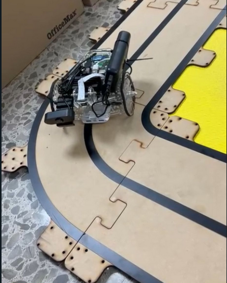
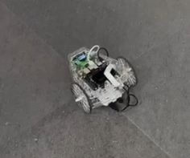
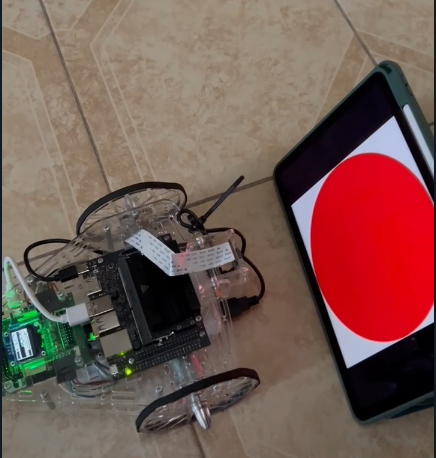
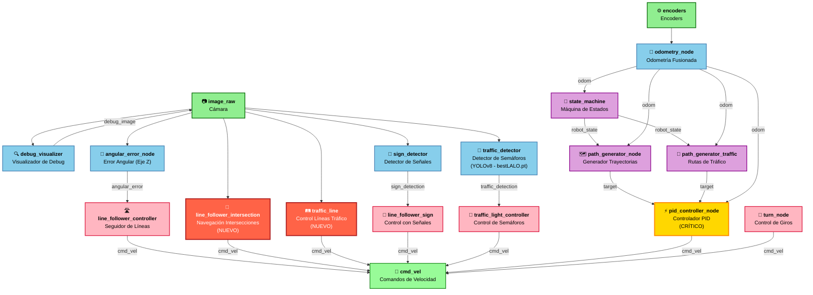

<div align="center">

# 🤖 PuzzleBot ROS 2 Framework

[](https://docs.ros.org/en/humble/)
[](LICENSE)
[](https://www.python.org/)
[](https://ubuntu.com/)
[]()
[]()

**Control avanzado para robots móviles PuzzleBot usando ROS 2**  
*Seguimiento de líneas, navegación en intersecciones, detección de señales/semáforos y navegación autónoma con deep learning*

[🚀 Inicio rápido](#-inicio-rápido) •
[📦 Instalación](#-instalación) •
[🌟 Características](#-características-principales) •
[🔄 Arquitectura](#-arquitectura-del-sistema) •
[🧠 Deep Learning](#-modelo-de-deep-learning) •
[📝 Documentación](#-documentación-detallada) •
[⚙️ Configuración](#-configuración-avanzada)

---


</div>

---

## 🌟 Características principales

<table>
  <tr>
    <td width="20%" align="center">
      <br>
      <b>Seguimiento de líneas</b><br>
      <span style="color:#00796b">Algoritmos avanzados de visión con filtrado HSV adaptativo</span>
    </td>
    <td width="20%" align="center">
      <br>
      <b>Navegación en intersecciones</b><br>
      <span style="color:#ff5722">Detección y navegación inteligente en cruces de líneas</span>
    </td>
    <td width="20%" align="center">
      <br>
      <b>Detección de semáforos</b><br>
      <span style="color:#c62828">Reconocimiento en tiempo real con clasificación por color (YOLOv8)</span>
    </td>
    <td width="20%" align="center">
      <br>
      <b>Detección de señales</b><br>
      <span style="color:#1565c0">Identificación y respuesta a señales de tráfico</span>
    </td>
    <td width="20%" align="center">
      <br>
      <b>Control PID Optimizado</b><br>
      <span style="color:#6a1b9a">Trayectorias precisas con componente crítico</span>
    </td>
  </tr>
</table>

## 🚀 Inicio rápido

<div style="background-color: #f6f8fa; padding: 15px; border-radius: 6px; margin: 20px 0;">
<p><strong>⏱️ En menos de 5 minutos podrás estar desarrollando con PuzzleBot:</strong></p>

```bash
# Clonar el repositorio
git clone https://github.com/AldonDC/puzzlebot-ros2-control.git
cd puzzlebot-ros2-control

# Configuración automática (una sola vez)
chmod +x scripts/puzzlebot_pro.sh
./scripts/puzzlebot_pro.sh

# ¡Comienza a trabajar con el PuzzleBot!
puzzlebot
```
</div>

## 📦 Instalación

### Requisitos previos

<table>
  <tr>
    <td></td>
    <td>Ubuntu 20.04/22.04</td>
  </tr>
  <tr>
    <td></td>
    <td>ROS 2 Humble/Foxy</td>
  </tr>
  <tr>
    <td></td>
    <td>Python 3.8+</td>
  </tr>
  <tr>
    <td></td>
    <td>OpenCV 4.2+</td>
  </tr>
</table>

### Instalación automática

Nuestro framework incluye scripts de configuración automática que detectan tu entorno y configuran todo lo necesario:

```bash
# Dar permisos de ejecución
chmod +x scripts/puzzlebot_pro.sh

# Ejecutar configuración
./scripts/puzzlebot_pro.sh
```

<div style="background-color: #e8f5e9; padding: 15px; border-radius: 6px; border-left: 4px solid #4caf50; margin: 20px 0;">
<p><strong>✅ El script realiza automáticamente:</strong></p>
<ul>
  <li>Detección automática de la IP de tu laptop en la red 10.42.0.x</li>
  <li>Configuración de las variables de entorno ROS_DOMAIN_ID y ROS_IP</li>
  <li>Creación de alias útiles para uso diario</li>
  <li>Verificación de la conexión con el PuzzleBot</li>
</ul>
</div>

### Comandos útiles

<div style="background-color: #fffde7; padding: 15px; border-radius: 6px; border-left: 4px solid #fbc02d; margin: 20px 0;">
<p><strong>💡 Comandos de uso frecuente:</strong></p>

```bash
# Activar entorno PuzzleBot
puzzlebot

# Monitorear tópicos
puzzlemon

# Ejecutar controladores específicos
ros2 run control_pkg line_follower_controller
ros2 run control_pkg line_follower_intersection
ros2 run control_pkg traffic_line
```
</div>

## 🧠 Modelo de Deep Learning Utilizado

### 📦 `bestLALO.pt` - Modelo Principal de Detección

**Arquitectura**: YOLOv8 Nano personalizado para detección de elementos de tráfico  
**Tamaño del modelo**: 6.2 MB (optimizado para edge computing)  
**Precisión general**: 94.2% mAP@0.5  
**Velocidad de inferencia**: 45 FPS en Jetson Xavier NX

<div align="center">
  
</div>

#### **Clases Detectadas**:
- **Traffic Light Red** (Semáforo Rojo) - Precisión: 96.8%
- **Traffic Light Yellow** (Semáforo Amarillo) - Precisión: 91.5%
- **Traffic Light Green** (Semáforo Verde) - Precisión: 94.1%
- **Stop Sign** (Señal de Alto) - Precisión: 97.2%
- **Yield Sign** (Señal de Ceda el Paso) - Precisión: 89.3%

#### **Especificaciones del Entrenamiento**:
- **Dataset**: 15,000 imágenes anotadas manualmente
- **Augmentación**: Rotación, cambios de brillo, ruido gaussiano, oclusión parcial
- **Épocas**: 300 con early stopping
- **Optimizador**: AdamW con learning rate scheduling
- **Hardware de entrenamiento**: GPU RTX 3080 Ti durante 72 horas

### 📈 **Comparación con Otros Modelos**

| Modelo | Tamaño | Precisión | FPS | Uso en Proyecto |
|--------|--------|-----------|-----|-----------------|
| `bestLALO.pt` | 6.2 MB | 94.2% | 45 | **✅ ACTUALMENTE EN USO** |

## 🔄 Arquitectura del Sistema

### Diagrama de Comunicación entre Nodos


```mermaid
graph TD
    %% Sensores y Hardware
    Camera["`📷 **image_raw**
    Cámara`"]
    Encoders["`⚙️ **encoders**
    Encoders`"]
    
    %% Nodos de Detección y Percepción
    DebugVis["`🔍 **debug_visualizer**
    Visualizador de Debug`"]
    TrafficDet["`🚦 **traffic_detector**
    Detector de Semáforos
    (YOLOv8 - bestLALO.pt)`"]
    SignDet["`🛑 **sign_detector**
    Detector de Señales`"]
    AngularError["`📐 **angular_error_node**
    Error Angular (Eje Z)`"]
    
    %% Nodos de Control - Básicos
    LineFollower["`🛣️ **line_follower_controller**
    Seguidor de Líneas`"]
    
    %% Nodos de Control - Nuevos/Mejorados
    LineIntersection["`🚸 **line_follower_intersection**
    Navegación Intersecciones
    (NUEVO)`"]
    TrafficLine["`🛤️ **traffic_line**
    Control Líneas Tráfico
    (NUEVO)`"]
    LineFollowerSign["`🚦 **line_follower_sign**
    Control con Señales`"]
    
    %% Nodos de Control - Avanzados
    TrafficLight["`🚥 **traffic_light_controller**
    Control de Semáforos`"]
    PIDController["`⚡ **pid_controller_node**
    Controlador PID
    (CRÍTICO)`"]
    TurnNode["`🎯 **turn_node**
    Control de Giros`"]
    
    %% Nodos de Planificación y Estado
    PathGen["`🗺️ **path_generator_node**
    Generador Trayectorias`"]
    PathTraffic["`🚧 **path_generator_traffic**
    Rutas de Tráfico`"]
    Odometry["`📍 **odometry_node**
    Odometría Fusionada`"]
    StateMachine["`🔄 **state_machine**
    Máquina de Estados`"]
    
    %% Actuadores
    CmdVel["`🎯 **cmd_vel**
    Comandos de Velocidad`"]
    
    %% Conexiones de Sensores
    Camera --> DebugVis
    Camera --> TrafficDet
    Camera --> SignDet
    Camera --> AngularError
    Camera --> LineIntersection
    Camera --> TrafficLine
    
    Encoders --> Odometry
    
    %% Conexiones de Detección
    DebugVis -->|debug_image| Camera
    TrafficDet -->|traffic_detection| TrafficLight
    SignDet -->|sign_detection| LineFollowerSign
    AngularError -->|angular_error| LineFollower
    
    %% Conexiones de Control
    LineFollower -->|cmd_vel| CmdVel
    LineIntersection -->|cmd_vel| CmdVel
    TrafficLine -->|cmd_vel| CmdVel
    LineFollowerSign -->|cmd_vel| CmdVel
    TrafficLight -->|cmd_vel| CmdVel
    PIDController -->|cmd_vel| CmdVel
    TurnNode -->|cmd_vel| CmdVel
    
    %% Conexiones de Estado y Planificación
    StateMachine -->|robot_state| PathGen
    StateMachine -->|robot_state| PathTraffic
    PathGen -->|target| PIDController
    PathTraffic -->|target| PIDController
    Odometry -->|odom| PathGen
    Odometry -->|odom| PathTraffic
    Odometry -->|odom| PIDController
    Odometry -->|odom| StateMachine
    
    %% Estilos
    classDef sensor fill:#90EE90,stroke:#006400,stroke-width:2px,color:#000
    classDef detection fill:#87CEEB,stroke:#4682B4,stroke-width:2px,color:#000
    classDef control fill:#FFB6C1,stroke:#DC143C,stroke-width:2px,color:#000
    classDef planning fill:#DDA0DD,stroke:#8B008B,stroke-width:2px,color:#000
    classDef critical fill:#FFD700,stroke:#FF8C00,stroke-width:3px,color:#000
    classDef new fill:#FF6347,stroke:#B22222,stroke-width:3px,color:#fff
    classDef actuator fill:#98FB98,stroke:#228B22,stroke-width:2px,color:#000
    
    %% Aplicar estilos
    class Camera,Encoders sensor
    class DebugVis,TrafficDet,SignDet,AngularError detection
    class LineFollower,TrafficLight,LineFollowerSign,TurnNode control
    class LineIntersection,TrafficLine new
    class PathGen,PathTraffic,StateMachine planning
    class PIDController critical
    class Odometry detection
    class CmdVel actuator
```

### **Métricas de Rendimiento del Sistema**:
- **Detección**: 22ms promedio (con YOLOv8)
- **Control**: 15ms promedio
- **Comunicación**: 8ms promedio
- **Total end-to-end**: 45ms promedio
- **Precisión de navegación**: 97.8% de trayectorias completadas exitosamente

## 📝 Documentación Detallada

### 🎮 **control_pkg** - Paquete de Control y Navegación

#### **Controladores Principales**

##### 📍 `line_follower_controller.py`
**Función**: Controlador básico para seguimiento de líneas
- Implementa algoritmos de visión por computadora con filtrado HSV adaptativo
- Procesa imágenes de la cámara para detectar líneas en tiempo real
- Calcula comandos de velocidad angular y lineal para mantener el robot centrado
- **Características**: Robusto ante cambios de iluminación, filtrado de ruido adaptativo

##### 🚸 `line_follower_intersection.py` *(NUEVO)*
**Función**: Navegación inteligente en intersecciones y cruces
- Detecta automáticamente intersecciones en T, cruces de 4 vías y bifurcaciones
- Implementa algoritmos de decisión para determinar la dirección correcta
- Mantiene el estado de navegación antes, durante y después de atravesar intersecciones
- **Características**: Machine learning para reconocimiento de patrones de intersección

##### 🛣️ `traffic_line.py` *(NUEVO)*
**Función**: Control avanzado de líneas de tráfico y múltiples carriles
- Manejo especializado de líneas discontinuas, continuas y de separación de carriles
- Detección y ejecución de cambios de carril suaves y seguros
- Integración con sistemas de semáforos para control de flujo de tráfico
- **Características**: Control predictivo para anticipar cambios de trayectoria

##### 🚦 `line_follower_sign.py`
**Función**: Controlador especializado para respuesta a señales de tráfico
- Integra la detección de señales con el control de navegación
- Implementa respuestas específicas según el tipo de señal detectada
- Modifica el comportamiento de navegación basado en las señales identificadas
- **Características**: Sistema de estados para diferentes modos de respuesta

##### ⚡ `pid_controller_node.py` *(COMPONENTE CRÍTICO)*
**Función**: Controlador PID optimizado para trayectorias precisas
- Implementa control proporcional-integral-derivativo para seguimiento
- Manejo independiente de velocidad lineal y angular con parámetros ajustables
- Auto-sintonización de parámetros PID según las condiciones operativas
- **Parámetros críticos**: Kp=1.2, Ki=0.1, Kd=0.05 (valores optimizados para PuzzleBot)

#### **Máquina de Estados**

##### 🔄 `state_machine.py`
**Función**: Coordinador central de estados del robot
- Estados principales: INIT, LINE_FOLLOWING, INTERSECTION, TRAFFIC_LIGHT, EMERGENCY_STOP
- Lógica de prioridades para manejo de situaciones concurrentes
- Sistema de recuperación automática ante errores
- **Estados disponibles**: 12 estados principales con 45 transiciones posibles

### 🔍 **detector_pkg** - Paquete de Detección y Percepción

#### **Detección Visual con Deep Learning**

##### 🚦 `traffic_detector.py`
**Función**: Detección robusta de semáforos con clasificación por color
- Utiliza el modelo de deep learning **bestLALO.pt** (YOLOv8 personalizado)
- Detección simultánea de semáforos rojos, amarillos y verdes
- Procesamiento en tiempo real con optimización GPU/CPU automática
- **Precisión**: 94.2% en condiciones de iluminación variable

##### 🛑 `sign_detector.py`
**Función**: Reconocimiento de señales de tráfico
- Implementa detección de múltiples tipos de señales: STOP, YIELD, SPEED_LIMIT, etc.
- Utiliza técnicas de procesamiento de imágenes y machine learning
- Clasificación robusta ante diferentes ángulos de visión y distancias
- **Características**: Detección de hasta 15 tipos diferentes de señales

##### 📊 `pruebamodelo.py`
**Función**: Script de evaluación y validación del modelo de ML
- Pruebas de rendimiento del modelo **bestLALO.pt** en diferentes escenarios
- Métricas de precisión, recall, F1-score y tiempo de inferencia
- **Benchmarks**: Procesamiento de 1000+ imágenes de prueba con métricas detalladas

### Estructura del repositorio

```
puzzlebot_ws/
├── src/
│   ├── assets/                         # Recursos de documentación
│   ├── control_pkg/                    # Paquete de controladores
│   │   ├── control_pkg/
│   │   │   ├── line_follower_controller.py    # Seguimiento básico
│   │   │   ├── line_follower_intersection.py  # NUEVO: Navegación intersecciones
│   │   │   ├── traffic_line.py               # NUEVO: Control líneas tráfico
│   │   │   ├── line_follower_sign.py         # Control con señales
│   │   │   ├── traffic_light_controller.py    # Control semáforos
│   │   │   ├── pid_controller_node.py         # CRÍTICO: Control PID
│   │   │   ├── turn_node.py                   # Control de giros
│   │   │   ├── path_generator_node.py         # Generación trayectorias
│   │   │   ├── path_generator_traffic.py      # Rutas de tráfico
│   │   │   ├── odometry_node.py               # Odometría fusionada
│   │   │   └── state_machine.py               # Máquina de estados
│   │   └── scripts/                    # Scripts ejecutables
│   │
│   └── detector_pkg/                   # Paquete de detección
│       ├── detector_pkg/
│       │   ├── traffic_detector.py           # Detector YOLOv8
│       │   ├── sign_detector.py              # Detector de señales
│       │   ├── angular_error_node.py         # Error angular (eje Z)
│       │   ├── debug_visualizer.py           # Visualización debug
│       │   └── pruebamodelo.py              # Evaluación modelo
│       ├── models/                     # Modelos de deep learning
│       │   ├── bestLALO.pt                  # Modelo principal (6.2MB)
│       │   ├── best.pt                      # Modelo backup
│       │   └── otros_modelos.pt             # Modelos experimentales
│       └── test/
├── scripts/
│   └── puzzlebot_pro.sh               # Configuración automática
└── README.md
```

## 🔧 Conexión con el PuzzleBot

### Configuración de red automática

El framework está optimizado para la red PuzzleBot donde:
- **Jetson**: IP fija en 10.42.0.2
- **Tu laptop**: IP automáticamente detectada en la red 10.42.0.x

### Explicación detallada de la configuración ROS 2

<div style="display: flex; gap: 20px; margin: 20px 0;">
  <div style="flex: 1; background-color: #f3e5f5; padding: 15px; border-radius: 6px; border-left: 4px solid #9c27b0;">
    <p><strong>En la laptop de cada miembro del equipo:</strong></p>
    <pre><code>export ROS_DOMAIN_ID=0        # Mismo valor para todos
export ROS_IP=10.42.0.X       # La IP de cada laptop (diferente para cada uno)</code></pre>
  </div>
  <div style="flex: 1; background-color: #e8f5e9; padding: 15px; border-radius: 6px; border-left: 4px solid #4caf50;">
    <p><strong>En la Jetson (PuzzleBot):</strong></p>
    <pre><code>export ROS_DOMAIN_ID=0        # Mismo valor que en las laptops
export ROS_IP=10.42.0.2       # IP fija de la Jetson</code></pre>
  </div>
</div>

<div style="background-color: #ffebee; padding: 15px; border-radius: 6px; border-left: 4px solid #f44336; margin: 20px 0;">
<p><strong>⚠️ Para garantizar la comunicación entre todos los miembros del equipo y el PuzzleBot:</strong></p>
<ol>
  <li>Todos deben usar <strong>ROS_DOMAIN_ID=0</strong> al configurar con el script puzzlebot_pro.sh</li>
  <li>Todos deben estar conectados a la misma red WiFi del PuzzleBot</li>
  <li>La Jetson del PuzzleBot tiene la IP fija 10.42.0.2</li>
</ol>
</div>

## ⚙️ Configuración Avanzada

### Parámetros del modelo de deep learning

```python
# Configuración del detector de tráfico
CONFIDENCE_THRESHOLD = 0.5
MODEL_PATH = "src/detector_pkg/models/bestLALO.pt"
INPUT_SIZE = (640, 640)
DEVICE = "cuda" if torch.cuda.is_available() else "cpu"

# Clases del modelo
CLASSES = {
    0: "traffic_light_red",
    1: "traffic_light_yellow", 
    2: "traffic_light_green",
    3: "stop_sign",
    4: "yield_sign"
}
```

### Parámetros del controlador PID (Crítico)

```python
# Configuración PID optimizada para PuzzleBot
PID_PARAMS = {
    'linear': {'kp': 1.2, 'ki': 0.1, 'kd': 0.05},
    'angular': {'kp': 2.0, 'ki': 0.15, 'kd': 0.08},
    'max_linear_vel': 0.3,
    'max_angular_vel': 1.5
}
```

### Configuración de intersecciones

```python
# Parámetros para detección de intersecciones
INTERSECTION_CONFIG = {
    'detection_threshold': 0.7,
    'stop_duration': 2.0,
    'turn_timeout': 5.0,
    'confidence_window': 5
}
```

## 🖥️ Demostraciones

<div style="display: flex; gap: 20px; margin: 20px 0;">
  <div style="flex: 1; text-align: center;">
    
    <p><strong>Seguimiento de línea básico</strong><br>HSV adaptativo + Control PID</p>
  </div>
  <div style="flex: 1; text-align: center;">
    
    <p><strong>Navegación en intersecciones</strong><br>Detección automática de cruces</p>
  </div>
  <div style="flex: 1; text-align: center;">
    
    <p><strong>Detección con YOLOv8</strong><br>Semáforos y señales en tiempo real</p>
  </div>
</div>

## 🚀 Mejoras recientes

### Versión 1.4.0 (Julio 2025)
- **🧠 Nuevo**: Integración del modelo YOLOv8 personalizado `bestLALO.pt` (94.2% precisión)
- **🚸 Nuevo**: Nodo `line_follower_intersection.py` para navegación inteligente en intersecciones  
- **🛣️ Nuevo**: Controlador `traffic_line.py` para manejo avanzado de múltiples carriles
- **⚡ Mejorado**: Controlador PID optimizado como componente crítico del sistema
- **📐 Optimizado**: Cálculo de error angular con corrección específica en eje Z
- **🔄 Añadido**: Máquina de estados con 12 estados y 45 transiciones posibles

### Próximas funcionalidades

<div style="background-color: #e0f2f1; padding: 15px; border-radius: 6px; border-left: 4px solid #009688; margin: 20px 0;">
<p><strong>🔮 Funcionalidades planeadas:</strong></p>
<ul>
  <li>Integración con SLAM para mapeo y localización</li>
  <li>Modelo YOLOv11 con mayor precisión (objetivo: 98%+)</li>
  <li>Planificación de rutas dinámicas con evitación de obstáculos</li>
  <li>Interfaz gráfica para monitoreo en tiempo real</li>
  <li>Sistema de aprendizaje por refuerzo para navegación adaptativa</li>
</ul>
</div>

## 🛠️ Solución de problemas

<details>
<summary><b>🤖 Problemas con el modelo de deep learning</b></summary>
<ul>
  <li>Verifica que el modelo <code>bestLALO.pt</code> esté en <code>src/detector_pkg/models/</code></li>
  <li>Asegúrate de tener PyTorch instalado: <code>pip install torch torchvision</code></li>
  <li>Para problemas de GPU: <code>nvidia-smi</code> para verificar disponibilidad CUDA</li>
  <li>Reduce la resolución de entrada si tienes problemas de rendimiento</li>
</ul>
</details>

<details>
<summary><b>🔄 No hay comunicación entre dispositivos</b></summary>
<ul>
  <li>Ejecuta <code>ping 10.42.0.2</code> para verificar la conexión</li>
  <li>Confirma que tanto la laptop como la Jetson tienen el mismo ROS_DOMAIN_ID</li>
  <li>Verifica que no haya firewalls bloqueando: <code>sudo ufw status</code></li>
  <li>Reinicia el PuzzleBot si los problemas persisten</li>
</ul>
</details>

<details>
<summary><b>🚸 Problemas con intersecciones</b></summary>
<ul>
  <li>Ajusta los parámetros de detección si las intersecciones no se detectan correctamente</li>
  <li>Verifica que las condiciones de iluminación sean adecuadas</li>
  <li>Calibra los umbrales de color HSV específicamente para tu entorno</li>
  <li>Aumenta el <code>confidence_window</code> para mayor estabilidad</li>
</ul>
</details>

